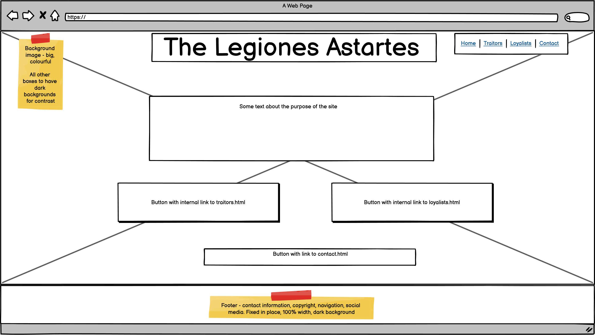
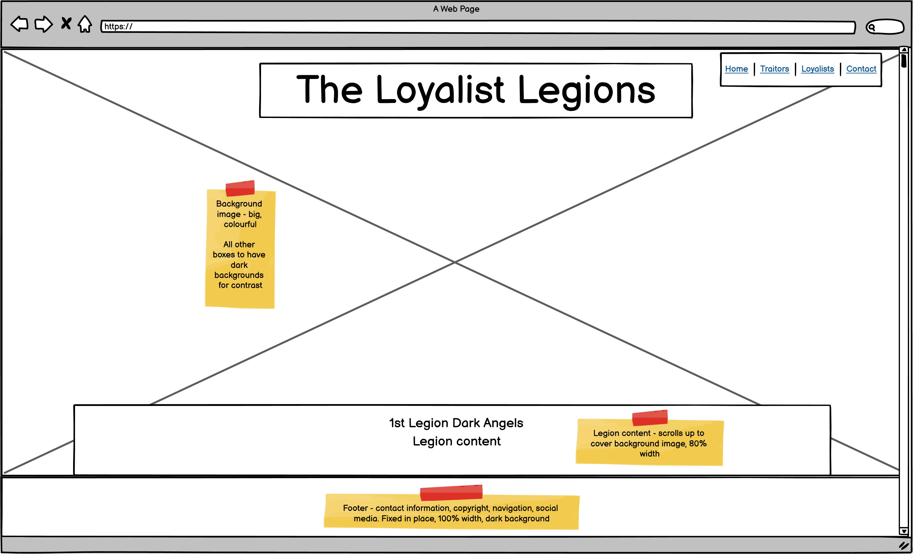
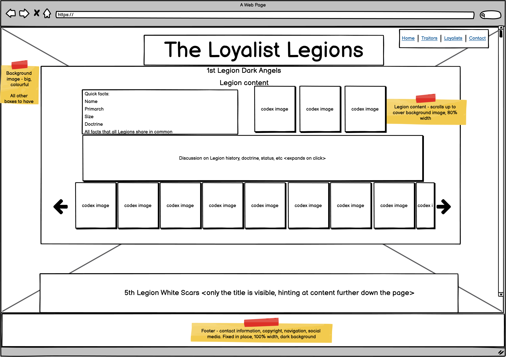
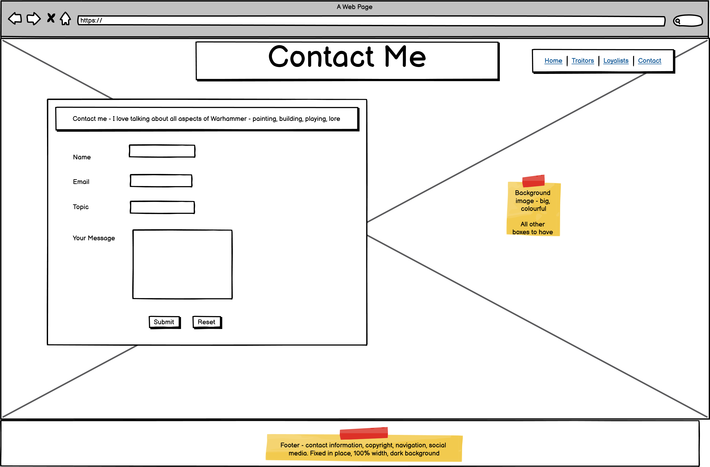
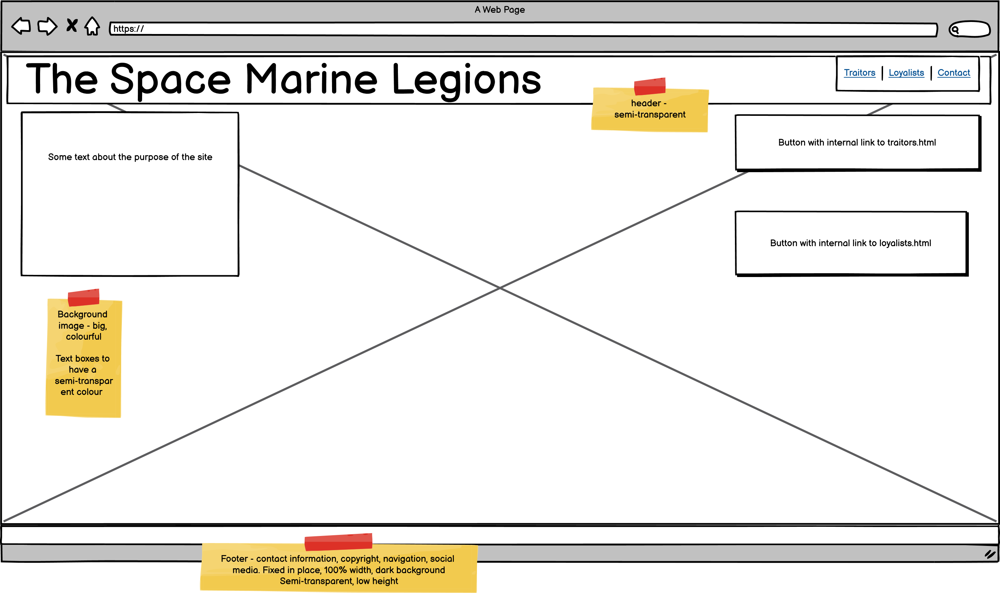
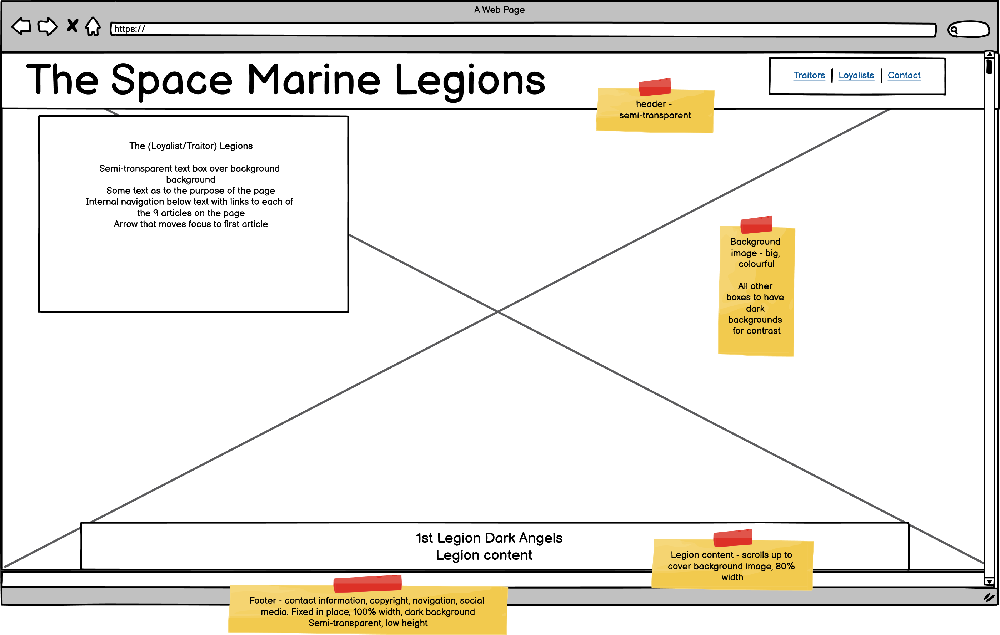
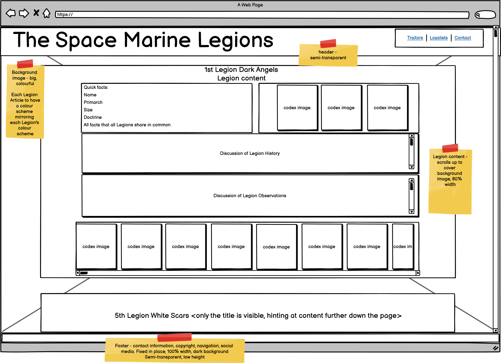
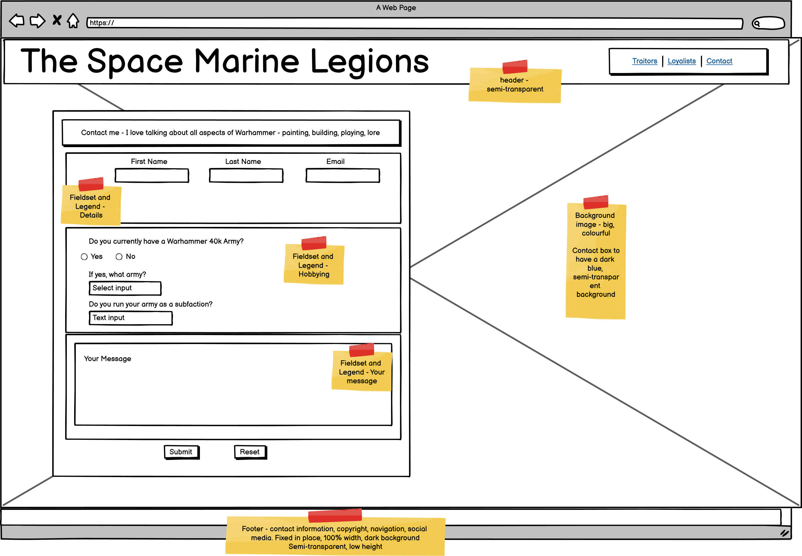

# The Space Marine Legions

# Code Institute Portfolio Project 1: User-centric Front-end Development using HTML and CSS

# Table of Contents

1. [Background](#background)
2. [Scope](#scope)
3. [Audience](#audience)
3. [Function](#function)
4. [User Stories](#user-stories)
5. [Wireframes](#wireframes)
6. [Features](#features)
7. [Design Choices](#design-choices)
8. [Accessibility](#accessibility)
9. [Future Work](#future-work)
10. [Bugs](#bugs)
12. [Technologies](#technologies)
13. [Deployment](#deployment)
    - [How this project was deployed](#how-this-project-was-deployed)
    - [How other users can work on this project](#how-other-users-can-work-on-this-project)
        - [Direct access](#direct-access)
        - [Template](#template)
        - [Local clone](#local-clone)
        - [Collaboration](#collaboration)
        - [Development preview browser](#development-preview-browser)
13. [Testing](#testing)
    - [Testing User Stories](#testing-user-stories)
    - [Testing Functionality](#testing-functionality)
    - [Testing on different devices](#testing-on-different-devices)
    - [Testing code](#testing-code)
14. [Credits](#credits)
    - [Inspiration](#inspiration)
    - [Images](#images)
    - [Acknowledgements](#acknowledgements)

## **Background**

I am a huge fan of the Warhammer 40,000 science-fiction setting. Warhammer 40k, as it is commonly known, is primarily a physical table-top game played with dice, painted miniatures and tape measures. It has existed in one form or another for about 40 years, and over that time, it has grown in many ways - playable armies, the range of miniatures, paints, and so on.

Another way in which it has grown is the background information, referred to as the lore or, more affectionately, the 'fluff' (as opposed to the 'crunch' of the physical game rules).

Much of the story-telling revolves around the primary human civilisation of the setting, the Imperium of Mankind, a hyper-militant fascistic theocracy spanning a million worlds. The Imperium itself has existed for 10,000 years. It was founded in the 31st Millenium, called M31 in the parlance of the setting, and the current setting takes place in the 41st Millenium, or M41. 

A long-running series of books, the Horus Heresy series, was started by Games Workshop's publishing house, Black Library, about 15 years ago, to explore the founding of the Imperium. The short version is this - the Imperium was founded by the Emperor of Mankind, who used genetically-enhanced warriors called Space Marines to conquer the Milky Way galaxy in a campaign called the Great Crusade. The Space Marines were organised into 18 Legions, each Legion having diverging doctrinally, organisationally and genetically. Each was led by a general - a genetically engineered being called a Primarch, who provided the genetic enhancements that created the Space Marines. 

As the Great Crusade drew to a close, the Emperor's most accomplished Primarch - Horus Lupercal of the 16th Legion - was named Warmaster, to direct the Great Crusade in the Emperor's stead. Some years later, after mysterious events on the moon of Davin, Horus betrayed the Imperium and the Emperor. He took fully half of the Space Marine Legions - his own 'Sons of Horus' and 8 others - into rebellion, and waged a campaign to topple the Emperor. Thus began the Horus Heresy. The other 9 Loyalist Legions opposed Horus, and wars of untold ferocity raged across human space. After years of hard fighting, Horus and his Traitor Legions arrived at Earth, the seat of the Emperor. 

The Siege of Terra, as the final battle was called, was titanic in scale. Casualties of both sides were immense. At the climax of the battle, when all seemed lost, the Emperor himself took the field, launching a teleport strike on Horus' flagship, his aim a decapitation stike both metaphorical and literal. The Emperor and Horus battled hand-to-hand. Horus, a consumate warrior-king, inflicted grevious injuries on the Emperor, but the Emperor proved victorius. With Horus' death, and Loyalist reinforcements imminent, the Traitor Legions broke and ran. 

The Space Marine Legions are interesting organisations. Each is very different. Their homeworlds, histories, Primarchs and genetics give rise to wildly varying cultures and combat doctrines. Some are savage berserkers, revelling in hand-to-hand combat. Others are more professional, excelling in modern combined-arms warfare. Others are stranger still, with focuses on armoured warfare, siege tactics, reconnaissance or infiltration. All have unique characters and histories. I personally am fascinated by the detailed backgrounds, organisations, doctrines and histories. 

## **Scope**

This website is intended to provide users with with a distillation of my knowledge of the Space Marine Legions. 

Other sites exist to do this - namely [the Warhammer 40k fandom wiki](https://warhammer40k.fandom.com/wiki/Warhammer_40k_Wiki) and [Lexicanum](https://wh40k.lexicanum.com/wiki/Main_Page)

That said, I personally dislike using these sites. The Lexicanum site has a boring and uninteresting colour palette of grey and black. The Fandom site is more interesting, especially with the striking background image. However, I find it suffers from bloat - the information is not condensed as you might expect from a wikia site, and is often copy-pasted directly from source material. Neither makes for an especially enjoyable reading experience - with Lexicanum, the user is forced to endure the bland colours, and with the Fandom site, the user to forced to trawl through a seemingly endless screed of often-contradictory information. 

This website aims to fix that. It will make good use of the fantastically detailed artwork and will use an appealing, setting-appropriate colour palette. The content presented will be my own distillation of the source material. As I am the sole author, I can ensure that all of the information presented is correct and accurate as best as I can determine, but that it does not go into unnecessary and trivial detail. It will also be focused entirely on the Space Marine Legions, though scope exists for additional pages to be added dealing with other aspects of the Horus Heresy setting, such as in-setting history, other factions and major battles. 

The site consists of 4 pages - an index landing page, a contact page, and two content pages, one for the Loyalist Legions and the other for the Traitor Legions.

The index page consists of a background image, an eye-catching heading, a small navigation pane on the upper-right hand side, a block of text discussing the purpose of the site and two buttons that are links to the two content pages. 

The content pages are the main feature of the site. Each features 9 articles, one for each of the Legions, since there were 9 Loyalist and 9 Traitor Legions.

The contact page is intended as a contact form, a way for users to get in touch with me to discuss any aspect of the Warhammer 40k setting, from books to rulesets. A properly working contact form is currently beyond my skills and beyond the scope of the project, though my Mentor has indicated that it is relatively simple to turn it into a working form. This should provide an excellent addition to the project. 

## **Audience**

The intended audience of this site are people who are already fans of the Warhammer 40k setting and who already have some knowledge of the setting's background information, but who have little knowledge of the finer details of the Space Marine Legions. This is deliberate - the setting is so complex that introducing a new person and getting them up to speed is considered a difficult task among existing fans. Adding sufficient content to the site to introduce a new person would make the site unwieldy and overlong, and that would be before any of the intended content could be added. The idea is for this site to be passed around existing fans in order to pass on knowledge that makes the setting even richer and more detailed. A page for the introduction of new people to the setting could be considered a future addition to the site. 

## **Function**

The index.html page is intended as the landing page. The page presents two calls to action - one to visit each of the two content pages. 

The traitors.html page is the page discussing Horus' Traitor Legions

The loyalists.html page is the page discussing the Imperium's Loyalist Legions

The contact.html page contains a contact form. As a working contact form is outside of the scope of the project and beyond my skills, it will merely submit the entered information to https://formdump.codeinstitute.net

## **User Stories**

Users should be able to easily determine the purpose of the site

Users should be able to easily navigate to the various pages of the site

Users should be able to easily navigate within the content pages

## **Wireframes**

### **Initial wireframes**

I had the idea for this project some weeks into starting the Code Institute course and began refining it mentally soon after. The project was properly started on the 24th of January 2022 with some basic wireframes drawn on a few sheets of A3 paper. These were refined into digital wireframes using Balsamiq, which were updated following a Mentor planning session with Ronan McLelland. These represent the initial design of the project. These are stored in the repository in the assets/wireframes/initial directory. The images are below. 

Homepage: 

Content pages: 
The wireframe for traitors.html and loyalists.html, as they will initially appear with the hero image fully visible, as both share the same template:  

 
The wireframe for traitors.html and loyalists.html with the content scrolled up to cover the background image and display the content, as both share the same template: 

Contact.png - the wireframe for contact.html, the contact form: 

### Final Wireframes

When the project was completed, I held a final planning session with Ronan McLelland, and he indicated that it would be a good idea to create new wireframes to represent the final design choices. This indicates that the initial design as represented above was closely adhered to, with some tinkering around the edges. These are below. 

Homepage: 

Content page: 

The wireframe for the traitor and loyalist pages with the content scrolled up to cover the background image. Both pages share the same template: 

Contact page: 

## **Features**

### **Header** 

Each of the four pages features a header. The header is marked out by a 50% transparent black background, which manifests as a dark strip. The header follows expected design 
convention, with a title on the left that can be clicked to return to the homepage, and a navigation bar on the right that users may used to navigate to each of the pages.
The consistent, simple and intuitive nature of the header allows the user to trust the site. 

### **Footer**

Each of the four pages features a footer. The footer is marked out by a thin dark grey stripe of 70% transparency. The footer contains copyright information (me, 2022), the hosting service (Github pages) and social media links. The text is small, and the idea is for the footer not to draw much attention, as the copyright and hosting service are not material to the user's experience. However, the icons, though small, are recognisable as the logos of popular social media services and their white colour contrasts well with the dark grey transparency of the footer, so the user shouldn't overlook or miss them. 

### **Unified colour scheme**

Each page of the site, beyond the homepage, was given a colour - red for the Traitor Legions, yellow for the Loyalist Legions, and blue for the contact page. This design choice is justified below, but the idea was to simplify the user experience of the home page. Since there are 5 buttons, two of which seem to link to the Traitor Legions and another two of which seem to link to the Loyalist Legions, all of which are in relatively close proximity on a desktop (less so on a smartphone), a user may become confused, thinking that the two buttons each go to different places. The unified colour scheme is designed to prevent this - by making the two buttons that go to the same place the same colour, a user can be confident that they are not missing out on content and can intuitively understand the structure of the site. 

Likewise, the Contact Me call to action at the bottom of each content page is given the same blue colour as the Contact me button in the navigation bar. Again, this allows the user to be confident that both buttons link to the same page. 

### **Internal Navigation**

The two content pages contain a considerable amount of internal navigation. The idea behind this is to give the user options when using the site, and to save them having to scroll through the entire page, which ended up being quite long. From the top of each content page, users can jump directly to each Legion article. At the top of each Legion article, either side of the heading, are icons that jump to the last and next Legion article, and at the bottom of each article is an icon that jumps to the next article. At the bottom of the last article are two icons. The single up arrow jumps to the previous article, and the double up arrow jumps to the introductory text. This allows the user to navigate a long page with only a few clicks or taps and a mimimum of scrolling. 

At the bottom of each contact page is a call to action to go to the contact page, with a request for collaboration or merely to start a conversation with me, a fellow Warhammer fan. 

### **Legion Articles**

The main content of the site are the 18 Legion Articles, each covering one of the 18 Space Marine Legions. The Traitor Legion page contains the 9 Traitor Legions, and the Loyalist Legion page contains the 9 Loyalist Legions. Each Legion article is given a different colour scheme (discussed below), corresponding to the common colour scheme of their armour. Each Legion Article contains 5 elements - a quick facts text box, a preview image gallery, two discussion text boxes and a main image gallery. 

The quick facts text box lists a handful of short facts about each Legion, where that information is available. Though considerably more of these quick facts exist for each Legion, the same quick facts are not available for all of the Legions, and so they were restricted to those available for all Legions, to provide a unity of display, and to reassure users that all of the content is loading properly. This is because if one particular Legion had more quick facts than another, a user might reasonable suspect that their device was not rendering all of the content properly, which may breed distrust with the site.

The discussion text boxes contain the main information about the Legion under discussion. The first discussion box deals with the history of the Legion, such as previous battles, their recruitment and any other pertinent historical information, and as such is written in the past tense. The second discussion box deals with the current observations of the Legion, such as doctrine, unique units, strengths and so on, and as such is written in the present tense. 

The image galleries are discussed directly below. 

### **Image Galleries** 

The site as a whole contains a great many images of legionaries of the Space Marine Legions. This is intentional, as within the Warhammer community, the artwork is considered an important aspect. As a result, a considerable effort was put into finding as many appropriate images for the project as possible. Each Legion Article contains two image galleries - a preview image gallery placed next to the quick facts, and a main image gallery placed underneath the discussion text boxes. The preview gallery always contains three images where possible, and is intended to act as an initial showcase for the user, visually informing the user of the Legion's colour scheme. The main image gallery contains all of the images I was able to source, excluding those deemed inapproproiate (discussed below), with each image being given a short description, pointing out notable features of the legionary in the image.   

### Contact form

The main feature of the Contact page is the contact form. As noted in the code in a comment, the form is non-functional, as a working form is currently beyond my skill-set, and the scope of this project. The purpose is twofold - to invite collaboration from users who wish to help me expand or refine the content of the site, and to act as an invitation to begin a conversation about any and all aspects of Warhammer. Since the community tends to be small and insular, setting up dialogues could lead to the formation or expansion of gaming groups or discussion forums. 

### **Accessibility**

I have taken pains to ensure that all images have either an aria-label or aria-labelledby attribute. Most images have been given an aria-labelledby attribute, since the images are present in both the full image gallery and the preview gallery, and hence the images in the preview gallery can use the description in the full image gallery. 

During development, I came across the alternative aria-describedby attribute, which appears to be intended for longer descriptions than aria-labelledby. However, the Code Institute course material I have covered so far has only mentioned aria-label and aria-labelledby, and I am aware that screen-readers and other assistive technologies place a higher priority on aria-labelledby over aria-label. I was unable to find anything related to the priority placed on aria-describedby, so I made the decision to stick with aria-labelledby, even though I am reasonably sure that the text in the main image galleries rises to the level of a descriptions. My mentor agreed with this decision.  

Those images that only exist in the preview gallery have been given an aria-label attribute, as it did not make sense to have image descriptions in the preview gallery when, in many cases, they would be duplicated in the full image gallery. 

## **Design Choices**

### **Font**

The Gothic A1 font-family was chosen for the text content for two reasons. First, it is a sans-serif font, and is both clean and sober. 
Secondly, the Gothic style feastures heavily in the Warhammer setting, with Gothic architecture, a Gothic language and a generally dark, bleak theme. 

The Open Sans font-family was chosen for the heading elements because the bold version of the Gothic A1 font-family has an uneven design that is somewhat jarring and has a slightly comical effect. Open Sans is a clean, legible, even font. 

### **Background images**

The background images were chosen for their visual impact - I wanted bold, exciting, violent images that draw the eye. 
The index.html background image features a Space Marine officer pointing using his power fist. It is of extraordinarily high definition, and is the image printed on the front of the 6th Edition Space Marine codex used in the tabletop wargame. It is a very heroic image that instantly catches the eye of the user. Since this is an image designed for a A4-sized reference book, the 'action' is centered in the middle of the page. This allowed me to place the introductory text and internal navigation buttons to the left-hand-side and right-hand-side of the page respectively, leaving the image unobscured. 

The traitors.html background image is a digital version of the cover image for the book "The First Heretic", and features members of the Word Bearers Gal Vorbak fighting the Legio Custodes. 

The loyalists.html background image is a digital version of the cover image for the book "Shadows of Treachery", and features the Imperial Fists boarding an Iron Warriors vessel whilst their ships engage behind them during the Battle of Phall.

The contact.html background image is a digital version of the cover image for the book "The Primarchs", and features Horus and Fulgrim quietly discussing some business during the Triumph of Ullanor. Since the contact page is designed to invite collaboration and discussion with users, I thought a non-violent image of two Primarchs talking was more suitable.

The background images for the content pages and the contact page were chosen as they are cover images that wrap around the front, spine and back of the books. This means that almost all of the 'action', so to speak, takes place in the right-most 40% of the image. The left-most 60% is mostly covered by the title of the book on the spine, and the blurb on the back cover. This allowed me to place the contact form and content page introductions on the left-hand-side of the page, where conventional visual hierarchy dictates the users' eye starts when they start looking at a page. Once the user has finished looking at the introductory text or has completed the contact form, the user is free to admire the main action of the background image, which is unobscured. 

These design choices only apply for larger screen sizes, such as desktops and laptops. Media queries have been implemented so that once the project is viewed on tablets and smartphones, the contact form and introductory text boxes expand to cover the background images. However, since the text boxes are semi-transparent, the background images are still mostly visible. 

### **Colour schemes**

I decided to use a unified colour scheme for each of the pages beyond the home page. This colour applies to the buttons in the navigation bar of the header, the buttons on the home page, the introductory text boxes on the content pages, and the contact form. The page for the Traitor Legions uses a dark red colour for its introductory text box with white text, and the corresponding button that links to that page on the homepage shares those colours. The same is true of the page for the Loyalist Legions, which uses a yellow text box and black text. 

The colour schemes for the Legion pages are deliberate, as they match the predominant colours used in the background images - dark red for the Gal Vorbak on the Traitor Legion page, and bright yellow for the Imperial Fist boarders for the Loyalist Legion page. 

The blue for the contact form and homepage introductory text was chosen for several reasons. Firstly, the dark blue matches the colour of the Space Marine's banner and armour. Secondly, blue is a calming colour and invites collaboration. Thirdly, it is a primary colour that contrasts well with the red and yellow of the other pages. 

Each Legion Article's colour scheme is designed to mimic the armour colours of the Legion it discusses. The primary colour of the armour plates is the background, and the detail colour of the edging is the colour of the text and borders. That said, some changes have been made for increased colour contrast. A full list is below:
Traitor Legions:

Emperor's Children - dark purple background with white text. The Emperor's Children traditionally use gold edging, but this offers insufficient contrast.

Iron Warriors - a light grey background with black text and yellow borders. Since this is quite plain, yellow and black hazard stripes have been applied to the upper corners of the quick facts and discussion text boxes, as this is the Iron Warriors' one concession to style. [This CSS Tricks article ](https://css-tricks.com/stripes-css/) and [this Youtube video](https://www.youtube.com/watch?v=4kWHW7da4U8) were used to apply hazard stripes to the text boxes.

Night Lords - dark blue background and white text. The Night Lords traditionally use steel-grey edging and a forked lightning effect in light blue, but grey on dark blue and light blue on dark blue provided insufficient contrast.

World Eaters - white background and dark blue text. No changes, as sufficient contrast is provided.

Death Guard - Off-white background and dark green text. No changes, as sufficient contrast is provided.

Thousand Sons - Dark red background and yellow text. The Thousand Sons traditionally use a bright red colour with gold edging, but a bright red background and gold text offered insufficient contrast, so this was changed to a darker red background and yellow text.

Sons of Horus - Dark sea-green background and white text. The Sons of Horus traditonally use a dark sea-green colour with black edging, but this offered insufficient contrast, so the text was changed to white, though black borders were retained.

Word Bearers - dark red background and white text. The Word Bearers traditonally use a dark red colour with silver-grey edging. Silver text did offer good contrast, but this was changed to white to provide increased contrast. 

Alpha Legion - dark blue/turquoise background and white text. The Alpha Legion traditionally use a lighter turquoise blue colour and silver edging, but this offered insufficient contrast. 

Loyalist Legions:
Dark Angels - dark grey background and white text. The Dark Angels tradtionally use a flat black colour with silver edging. This looked nice, but white text offered increased contrast. The black background also felt quite intimidating as the colour of the first article, so it was changed to a softer dark grey.

White Scars- white background and red text. The White Scars tradtionally use a brighter red edging, but this offered insufficient contrast. 

Wolves of Fenris - dark grey background and bone-coloured text. The Wolves use a dark grey colour and bone-coloured edging, as well as bone charms attached to their armour. The bone colour is quite close to white, so there is good contrast.

Imperial Fists - bright yellow background and black text. I considered darkening off the yellow background, but this offered insufficient contrast with the black text. The overall effect is quite striking. 

Blood Angels - dark red background and white text. Initially, silver was used for the text, but this offered insufficient contrast as it is more of a light grey. Traditional black edging is used for the borders. 

Iron Hands - light grey background and black text. The Iron Hands traditionally use a dark steel grey, with details in black and white. A dark grey with white text scheme was used, but this offered insufficient contrast, so I decided on a light grey colour with black text. 

Ultramarines - dark blue background and gold text. This offers good contrast.

Salamanders - dark green background and yellow text. Initially, orange text was used to mimic the Salamanders flame decals, but this offered insufficient contrast, so it was changed to yellow.

Raven Guard - black background and white text. As with the Dark Angels, this colour scheme could appear intimidating, but since this is the last article, I deemed this okay. It also matches the Raven Guard colour scheme perfectly. 

### **Image galleries**

I decided to use two image galleries - a main and a preview. This was because, while all of the images were of a suitable quality, not all had the same proportions. Those images of legionaries with features that protrude above their helmets (helmet crests, spotlights, turbine jet packs, spikes) have the same proportions as those images of legionaries with such protrusions, so those legionaries with protrusions appear shrunken. Those 'shrunken' images were moved to the preview galleries where they could still be present, but not disrupt the flow of the full image gallery. The reverse is true of the Emperor's Children article, where the larger images are in the preview gallery and the smaller images are in the main gallery, since there were more smaller images than larger images, and I wanted to include as many images as possible. 

When inserting the images into the image galleries, I used a consistent ordering system. Images of legionaries in MkII armour (identified by the segmented, overlapping armour plates) were first, then images of legionaries in MkIII armour (identified by grilled helmets and codpieces), then images of legionaries in MkIV armour (identified by combined leg and knee armour), then images of breachers (identified by shields), then images of terminators (identified by bulky armour that encloses the head), then images of basic Contemptor Dreadnoughts (identified by having either 1 or 2 claw arms), then images of Contemptor-Mortis Dreadnoughts (identified by 2 gun arms), then specialised Dreadnoughts (Leviathan and Deredeo Dreadnoughts, identified by their bulkiness and general difference). 

This ordering system was altered slightly for the images of Night Lords legionaries, as the first five images are all of legionaries from a single group, so it made sense to keep them together. 

The system was also altered in the case of the Death Guard preview gallery, where the image of the Dusk Raider is shown last. This is because of the altered colour scheme, which has no descriptive text to explain it. 

For several Legions - the Dark Angels, White Scars, Wolves of Fenris, Blood Angels and Thousand Sons - there were few images available. I suspect this is because the codexes (the source material containing the images) discussing these Legions have not been available for very long, and hence the Warhammer community hasn't been able to acquire, digitize and post a large number of images to the Fandom articles. Rather than use sub-standard images, I decided to use a 4th-wall break, explaining the lack of images from the perspective of the historian writing the articles using a feasible, in-universe explanation. My mentor assures me that this is perfectly acceptable. 

Should I deploy and run the site in a meaningful way by expanding the content and inviting collaboration from others, it would be a good idea to create dedicated social media accounts for the project and its collaborators. These would be accessed by updating the social media links in the footers of each page so that they open these accounts in new tabs.

## **Bugs**

A small bug was noted early in development - When navigating to the traitor.html and loyalist.html pages, ocassionally the scroll-bar on the right-hand-side of the screen does not load, though scrolling is still possible via mouse-wheel. Since the scroll-bar takes up viewport width, the positioning and dimensions of the content of the pages is adjusted. The lack of the scroll-bar and subsequent adjustment is especially apparent when navigating from traitor.html to loyalist.html and vice-versa, as they have essentially the same layout - the elements appear to jerk to the right. This is jarring. As of 3/2/2022, the cause of this is unknown, possibly related to internet connection speeds and browser load times - at the time, the site was importing many placeholder images. As of the end of the development, this bug has not been encountered. As the site is now pulling in fewer images and these from the repository, it is likely that the large number of placeholder images were slowing down the load times. 

When adding the images, it was noted that not all of the images are of the same dimensions. This is probably due to the images being acquired from different sources. Broadly speaking, the images of legionaries come in two different sizes - roughly 120px wide by 200px high, and 135px wide by 200px high, with a pixel or two difference. When viewed in the image galleries, this was jarring. This was eventually solved by cutting down the number of images and only using those of a consistent height and width, and possessing a white background. 

The commits made from the 12th of February to the 19th of February may be confusing, as I was constantly adding and removing images. Those that were removed were considered unsuitable. Hence, the flow of the project's development may appear disrupted around this point, though I was working around variable image qualities and a lot of a consideration about what images were suitable was needed. 

## **Future work**

Since this project only uses HTML and CSS, a working contact form that actually allows a user to send me a message would be an excellent feature to add.

Per the wireframes for the content pages, buttons that scroll the images in the image galleries back and forth were originally envisioned. However, research into this showed that this was only possible using JavaScript, such as [in this tutorial](https://www.youtube.com/watch?v=82f07Xf0xgE). Once I have learned JavaScript, buttons may be added. 

The Warhammer 40k Horus Heresy setting includes background information on many other organisations, such as the Titans Legions, the Mechanicum and the Imperial Household. These should proves excellent additions to the site. 

When locating the images of legionaries for the image galleries, many images of vehicles were located. These proved to be quite small in comparison to the images of legionaries, so they were omitted. A good future aim would be to find a way to add these into the image galleries, possibly into a separate image gallery and increase their size. 

## **Technologies**

[Github](https://github.com/) was used to host the project repository.

[Gitpod](https://gitpod.io/) was used to create and edit the project files. The Preview Browser proved useful in seeing the results of minor changes.

[Github Pages](https://pages.github.com/) was used to deploy the site and allow it to be accessed by the general public.

[Balsamiq](https://balsamiq.com/) was used to create the initial digital wireframes.

[Slack](https://slack.com/intl/en-gb/) was used to hold video calls with my Mentor, Ronan McLelland, and discuss the direction of the project and its features.

[Font Awesome](https://khan.github.io/Font-Awesome/) was used to apply the internal navigation arrows on the content pages. 

The Lighthouse function of the Chrome Developer Tools was used for testing the performance, accessibility and user experience. 

## **Deployment**

### **How this project was deployed**

This project was deployed using Github Pages as follows:

1. I logged in to Github.
2. I navigated to my profile page.
3. Under the Repositories tab, I located this project's repository.
4. Under the Settings tab, I clicked Pages.
5. Under Source, I opened the drop-down menu that by default displays None, and selected the main branch.
6. A drop-down menu that by default displays /root was not modified.
7. I then clicked Save.
8. I then waited for a minute to allow Github Pages to build the website.
9. I then refreshed the page and then right-clicked the link displayed in the green box to bring up options and then selected Open Link in New Tab, so that I did not navigate away from the repository. 

### **How other users can work on this project**

Other users may access this project using Gitpod by following the steps below: 

1. Install the Google Chrome or Firefox browser.
2. Navigate to Github.
3. Log into GitHub or create a Github account, if you don't already have one.
4. Navigate to my Github profile - [Adam Boley](https://github.com/AdamBoley).
5. Under the Repositories tab, locate the repository named "The-Space-Marine-Legions".
6. Click on the repository to view it.  

Users may then undertake several courses of action. 
1. They may directly access the code from my repository.
2. They may clone it as a template (I have enabled this).
3. They may choose to run the project locally on their computer.
4. Once the contact form has been implemented, users may use this to initiate a conversation with me to request collaboration. If I accept, I will add that user as a collaborator, and then they may fork this repository to their own accounts. 

#### **Direct access**

Users may directly access the code by following the steps below:
1. Install the Chrome Gitpod extension or Firefox Gitpod extension, depending on the user's choice of browser.
2. On the project repository, click the green Gitpod button.
3. Wait several minutes for Gitpod to build the workspace.

#### **Template**

I have set this repository as a template, and users may clone this repository using this. This creates a repository in their own Github account, and they may access it freely. This may be done by following the steps below:
1. From the repository page (see above), click the button named "Use this template".
2. Since this is technically a new repository, the user may give it a new name.
3. Optionally, the user may give the project a description.
4. The user may set the repository at either Public or Private.
5. The user may also opt to include all branches, though in this case, this option is redundant, since I created the project using only one branch. 
6. Click the green button at the bottom to create a new repository from this template.

#### **Local clone**

Users may clone the repository to their personal conputer by following the steps:
1. Click the "Code" dropdown button. 
2. Under the "Clone" heading, click the "HTTPS" sub-heading so that it has an orange underline.
3. Copy the URL of the repository by either clicking the clipboard icon, or clicking on the URL directly, right-clicking and selecting "Copy".
4. Open your preferred Integrated Development Environment on your PC (VSCode, Atom, PyCharm, etc).
5. Ensure your IDE supports Git, or has the relevant Git extension installed.
6. Open the terminal of the IDE, and create a directory where you would like the repository to be stored.
7. Type <code>git clone</code>, paste the copied URL and press enter.
8. The repository will then be cloned to your selected directory.

Alternatively, users may download the repository's files as a compressed ZIP folder and access them on their personal computer by following the steps below:
1. Click the "Code" dropdown button. 
2. Click the "Download ZIP" option. 
3. A download will begin. 
4. On your personal computer, navigate to the Downloads folder, and extract the files to a location of your choice, ensuring that you have an appropriate extraction tool.
5. Open the IDE of your choice.
6. Through the IDE interface, navigate to the location of the downloaded project files and open them. 
7. You now have offline local access to the project files. 

#### **Collaboration**

Users who have requested collaboration with me will be add as contributors to the project. Once this is done, they may fork the repository to their own accounts by following the steps below:
1. On the repository page, click the "Fork" button in the upper right-hand corner.
2. This clones the repository and creates a repository with the same name, files and file structure as the original. 
3. Users may edit the project files by either cloning the repository to their personal computer and using a local IDE, or by using Gitpod (see above for directions for both options).
4. Once changes have been made, users may push them to the original repository (mine) by staging, committing and pushing the changes, and then creating a Pull Request. I will then examine the changes and either approve or deny the changes. 

#### **Development preview browser**

If the user is using Gitpod, changes can be previewed before committing them by opening a preview browser, which mimics how the website would look when deployed. 

Since the project just consists of HTML and CSS, there are no external libraries or dependencies required. A preview browser can be opened by running the server. This can be done by following the steps below: 
1. Open a new terminal by clicking the hamburger icon, going to Terminal and selecting New Terminal, if a terminal isn't open already.
2. Ensure changes are saved by either manually saving or using the keyboard shortcut CTRL + S. 
3. Type in the terminal <code>python3 -m http.server</code> and press Enter.
4. A blue box should appear. Click the Open Browser button. 
5. A new tab will open displaying a preview of the website. 
6. Should further changes be made to the code, save them and then hard-refresh the preview browser tab by the keyboard shortcut CTRL + R. The preview will update with the changes. 

## **Testing**

### **Testing User Stories**

The stated User Stories are below, along with how they have been fulfilled:

**User Story**: 
Users should be able to easily determine the purpose of the site. 

**Fulfilment**: 
The introductory text, use of the term Space Marine, and the iconic background image of a Space Marine easily identify the purpose of the site, as the intended audience are those who already have some knowledge of the Warhammer setting.

**User Story**: 
Users should be able to easily navigate to the various pages of the site

**Fulfilment**: 
Navigation to the various pages of the site is easily accomplished by means of the navigation bar at the top of the page. This navigation bar is in a place users of other websites would expect. 

In addition, the landing page has 2 distinct calls to action to visit the content pages. 

At the bottom of the content pages is a call to action to visit the contact page.

**User Story**: 
Users should be able to easily navigate within the content pages

**Fulfilment**: 
Internal navigation within the content pages is easily accomplished via the internal navigation links to each of the Legion articles in the introductory text of both content pages. 

In addition, each Legion article has has and up arrow and a down arrow in the heading that navigate to the previous and next article respectively. Further more, each Legion article has a down arrow at the bottom that brings the focus to the next article down. At the bottom of the last article of both pages is a a double up arrow that brings the user back up to the introductory text. 

### **Testing functionality**

This section deals with my tests of the functionality of the site, presented in table format:

| Action                                                             | Expected result                              | Actual result                                             |
| ------------------------------------------------------------------ |:---------------------------------------------| :---------------------------------------------------------|
| Click on The Traitor Legions button in the navigation bar          | Navigate to the Traitor Legions page         | Navigate to the Traitor Legions page                      |
| Click on The Loyalist Legions button in the navigation bar         | Navigate to the Loyalist Legions page        | Navigate to the Loyalist Legions page                     |
| Click on the Contatc me button in the navigation bar               | Navigate to the Contact Me page              | Navigate to the Contact Me page                           |
| Click on The Traitor Legions button on the homepage                | Navigate to the Traitor Legions page         | Navigate to the Traitor Legions page                      |
| Click on The Loyalist Legions button on the homepage               | Navigate to the Loyalist Legions page        | Navigate to the Loyalist Legions page                     |
| Click on The Space Marine Legions title in the Heading             | Navigate to the homepage                     | Navigate to the homepage                                  |
| Click on the Contact Me button at the bottom of the Traitor page   | Navigate to the contact page                 | Navigate to the contact page                              |
| Click on the Contact Me button at the bottom of the Loyalist page  | Navigate to the contact page                 | Navigate to the contact page                              |
| Click on the Submit button at the bottom of the Contact form       | Display standard response from form-dump     | Display standard response from form-dump                  |
| Click on the Reset button at the bottom of the Contact form        | Clear all form input fields                  | Clear all form input fields                               |
| Click on the Facebook social media icon in the footer              | Browser opens a new tab for Facebook         | Browser opens a new tab for Facebook                      |
| Click on the Twitter social media icon in the footer               | Browser opens a new tab for Twitter          | Browser opens a new tab for Twitter                       |
| Click on the Youtube social media icon in the footer               | Browser opens a new tab for Youtube          | Browser opens a new tab for Youtube                       |
| Click on the Instagram social media icon in the footer             | Browser opens a new tab for Instagram        | Browser opens a new tab for Instagram                     |

### **Testing on different devices**

The deployed project works as intended on my personal computer using Google Chrome. All links work as above, and all background images display at the correct resolution. This is to be expected, since development was primarily conducted using this PC with Google Chrome. 

Some development was also carried out on my laptop, an Asus E510 using Google Chrome. All links worked and all background images displayed as intended. 

I also have access to a Samsung A20 smartphone. The deployed project works as intended on it, with background images cut down around the specified background-position style rules designated in the media queries, and all links working as above.

I also have access to two iPad tablets. The deployed project works mostly as intented on them - all links work as intended, and the background images for the homepage and the contact page display as intended, cut down around the specified background-position style rules designated in the media queries. However, the background images for the content pages failed to load as intended. They did not default to the background-color, but instead appeared to be highly zoomed in and hence very blurry, though it is difficult to be sure of this. However, it must be noted that these iPads are approximately 5 years old, and hence may not be running the most up-to-date versions of Google Chrome. It is also possible that the sheer size of the HTML files was causing the problems. 

### **Testing code**

#### HTML validation

Note: At the time of testing (28/02/2022), the W3C HTML validator was unavailable, with all attempts to access it resulting in a 503 error. A Slack post was made by Jim Morrell at 10.23AM on the 28th in the Announcements channel confirming this. As the submission deadline was approaching, I decided to use an alternative validation service - 
[Free Formatter](https://www.freeformatter.com/html-validator.html). The results are recorded below:

Index.html - No errors were found, the document is valid and conforms to best practices and standards.

Traitors.html - Some errors were initially found, relating to misspelled attribute names and stray element tags. Other errors were found relating to overly long p elements that contained unordered lists. The unordered lists were removed from the p elements. Once these errors were cleaned up, the document was found to be valid and conforming to best practices and standards. 

Loyalists.html - Again, some errors were initially found, relating to misspelled attribute names and stray element tags. Other errors were found relating to overly long p elements that contained unordered lists. The unordered lists were removed from the p elements. Once these errors were cleaned up, the document was found to be valid and conforming to best practices and standards.  

Contact.html - No errors were found, the document is valid and conforms to best practices and standards. 

#### Jigsaw CSS validator

Note: In contrast to the W3C HTML validator, the Jigsaw CSS validator was working at time of testing. The result is below:

Styles.css - No errors were found, though 4 warnings were detected. Two related to the imported fonts, which are classed as imported style sheets due to the @import tag. The other two related to the break-word value applied to the style rules on lines 586 and 598, as the break-word value is deprecated. The [MDN page](https://developer.mozilla.org/en-US/docs/Web/CSS/word-break) on the word-break property lists word-break as a valid value, though Internet Explorer does not support it. The value was hence changed to normal, which showed no errors when tested using the preview browser. The validator showed no errors with thos correction. 

#### Lighthouse performance testing

Index.html:
- Performance: 99%
- Accessibility: 97%
- Best Practices: 92%
- SEO: 100%

Traitors.html:
- Performance: 95%
- Accessibility: 98%
- Best Practices: 100%
- SEO: 100%

Loyalists.html:
- Performance: 95%
- Accessibility: 98%
- Best Practices: 100%
- SEO: 100%

Contact.html:
- Performance: 99%
- Accessibility: 100%
- Best Practices: 100%
- SEO: 100%

## **Credits**

### **Inspiration**

[The Warhammer 40k fandom wiki](https://warhammer40k.fandom.com/wiki/Warhammer_40k_Wiki) and [Lexicanum](https://wh40k.lexicanum.com/wiki/Main_Page) provided the idea of a wikia-type website for the Space Marine Legions. The Fandom site with its colourful background and dark box containing the content overlaying it was a definite inspiration.

### **Images**

Images and descriptions for the Dark Angels Legion were obtained from: 
[The Warhammer Fandom article on the Dark Angels](https://warhammer40k.fandom.com/wiki/Dark_Angels)

Images and descriptions for the Emperor's Children Legion were obtained from: 
[The Warhammer Fandom article on the Emperor's Children](https://warhammer40k.fandom.com/wiki/Emperor%27s_Children)

Images and descriptions for the Iron Warriors Legion were obtained from: 
[The Warhammer Fandom article on the Iron Warriors](https://warhammer40k.fandom.com/wiki/Iron_Warriors)

Images and descriptions for the White Scars Legion were obtained from: 
[The Warhammer Fandom article on the White Scars](https://warhammer40k.fandom.com/wiki/White_Scars)

Images and descriptions for the Wolves of Fenris Legion were obtained from: 
[The Warhammer Fandom article on the Wolves of Fenris](https://warhammer40k.fandom.com/wiki/Space_Wolves)

Images and descriptions for the Imperial Fists Legion were obtained from: 
[The Warhammer Fandom article on the Imperial Fists](https://warhammer40k.fandom.com/wiki/Imperial_Fists)

Images and descriptions for the Night Lords Legion were obtained from: 
[The Warhammer Fandom article on the Night Lords](https://warhammer40k.fandom.com/wiki/Night_Lords)

Images and descriptions for the Blood Angels Legion were obtained from: 
[The Warhammer Fandom article on the Blood Angels](https://warhammer40k.fandom.com/wiki/Blood_Angels)

Images and descriptions for the Iron Hands Legion were obtained from: 
[The Warhammer Fandom article on the Iron Hands](https://warhammer40k.fandom.com/wiki/Iron_Hands)

Images and descriptions for the World Eaters Legion were obtained from: 
[The Warhammer Fandom article on the World Eaters](https://warhammer40k.fandom.com/wiki/World_Eaters)

Images and descriptions for the Ultramarines Legion were obtained from: 
[The Warhammer Fandom article on the Ultramarines](https://warhammer40k.fandom.com/wiki/Ultramarines)

Images and descriptions for the Death Guard Legion were obtained from: 
[The Warhammer Fandom article on the Death Guard](https://warhammer40k.fandom.com/wiki/Death_Guard)

Images and descriptions for the Thousand Sons Legion were obtained from: 
[The Warhammer Fandom article on the Thousand Sons](https://warhammer40k.fandom.com/wiki/Thousand_Sons)

Images and descriptions for the Sons of Horus Legion were obtained from:  
[The Warhammer Fandom article on the Black Legion](https://warhammer40k.fandom.com/wiki/Black_Legion)
(The Sons of Horus were later known as the Black Legion, so images for their previous incarnation are to be found on the page for the Black Legion)

Images and descriptions for the Word Bearers Legion were obtained from: 
[The Warhammer Fandom article on the Word Bearers](https://warhammer40k.fandom.com/wiki/Word_Bearers)

Images and descriptions for the Salamanders Legion were obtained from: 
[The Warhammer Fandom article on the Salamanders](https://warhammer40k.fandom.com/wiki/Salamanders)

Images and descriptions for the Raven Guard Legion were obtained from: 
[The Warhammer Fandom article on the Raven Guard](https://warhammer40k.fandom.com/wiki/Raven_Guard)

Images and descriptions for the Alpha Legion were obtained from: 
[The Warhammer Fandom article on the Alpha Legion](https://warhammer40k.fandom.com/wiki/Alpha_Legion)

The above images were, in all likelihood, originally sourced from digital versions of the Horus Heresy codexes by the community, so original credit must go to the [Forge World](https://www.forgeworld.co.uk/en-GB/FW-Home) design team who produce the artwork for each codexes. I was sadly unable to locate the names of these artists, though having visited Games Workshop's headquarters, I know they exist. Hence, credit must go to [Games Workshop](https://www.games-workshop.com/en-GB/Home) as the intellectual property holder.  

The contact page background image was obtained from:  
[Cute Wallpaper](https://cutewallpaper.org/download.php?file=/21/horus-heresy-wallpaper/Horus-Heresy-Wallpapers-1920x1080-Warhammer-in-2019-.jpg) 

The index page background image was obtained from: 
[Teahub](https://www.teahub.io/down/hJooTx_warhammer-40k-ultramarine-artwork-strong-warhammer-40k/)

The traitor content background image was obtained from:  
[Cute Wallpaper](https://coolwallpapers.me/6058809-first-heretic-aaron-dembski-bowden-warhammer-40k-horus-heresy.html)

The loyalist content background image was obtained from:  
[Warhammer Fandom](https://warhammer40k.fandom.com/wiki/Battle_of_Phall)

### **Acknowledgements**

Alan Bligh, John French, Andy Hoare, Neil Wylie, Anju Malhotra - A massive thanks to these authors for writing the Horus Heresy codicies from which the information on this site was gathered and distilled. Sadly [Alan Bligh died in 2017 from cancer](https://www.belloflostsouls.net/2017/05/bell-tolls-alan-bligh.html). In a way, this site is dedicated to Alan's memory and his near-legendary contribution to the Warhammer setting. RIP Alan. 

[Games Workshop](https://www.games-workshop.com/en-GB/Home)/[Forge World](https://www.forgeworld.co.uk/en-GB/FW-Home)/[Black Library](https://www.blacklibrary.com/default.aspx) - For creating the Warhammer 40k setting and publishing Alan Bligh et al's work.  

[Ronan McLelland](https://www.linkedin.com/in/ronanmcclelland/) - my Mentor, who proved invaluable in project planning and providing guidance on User Design and User Experience principles.

[This CSS Tricks article](https://css-tricks.com/couple-takes-sticky-footer/) was particularly helpful in making the footer stick the bottom of the page. 

[This CSS Tricks article ](https://css-tricks.com/stripes-css/) and [this Youtube video](https://www.youtube.com/watch?v=4kWHW7da4U8) were used for instruction on how to apply hazard stripes to the Iron Warriors Legion Article quick facts and discussion text boxes. 

F.D. Bartholmew Boley - for his useful contributions to the development process. 

