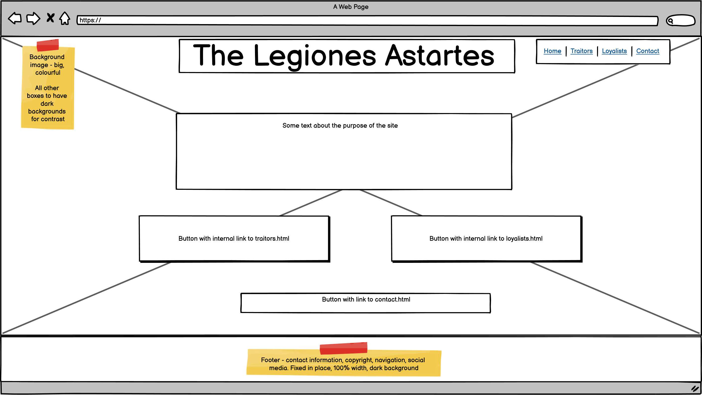
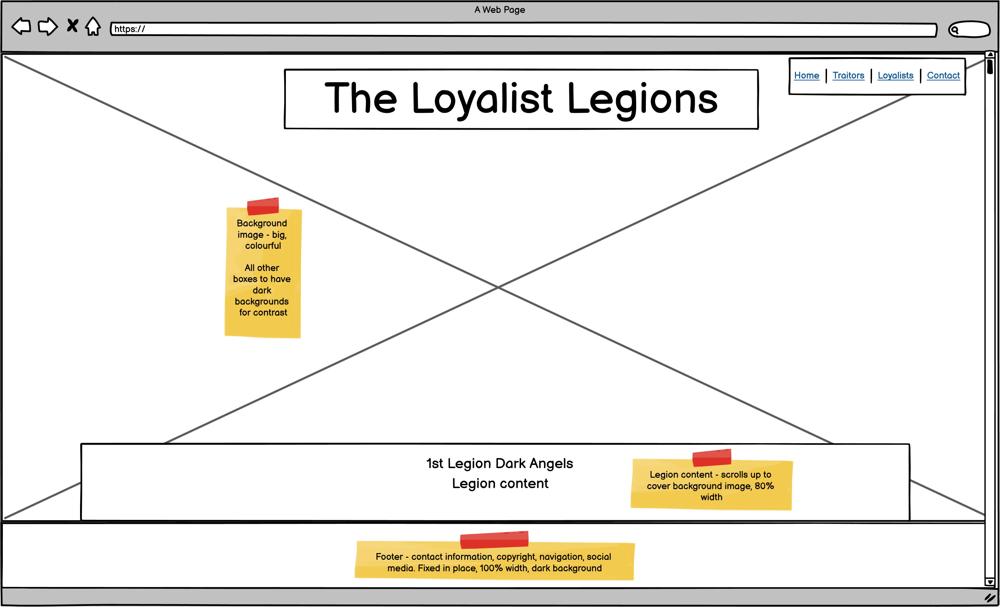
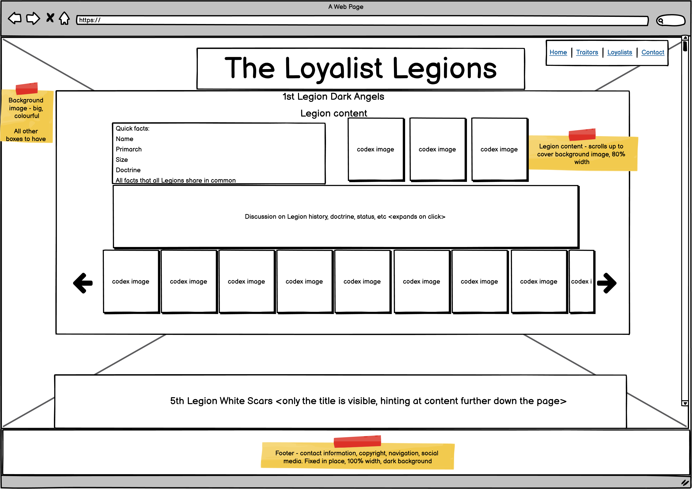
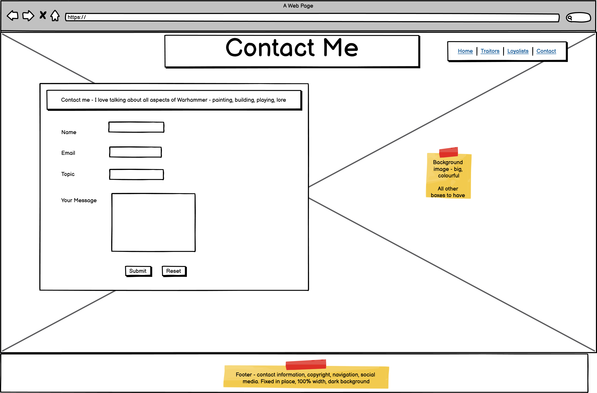

# The Space Marine Legions

# Code Institute Portfolio Project 1: User-centric Front-end Development using HTML and CSS

## Background

I am a huge fan of the Warhammer 40,000 science-fiction setting. Warhammer 40k, as it is commonly known, is primarily a physical table-top game played with dice, painted miniatures and tape measures. It has existed in one form or another for about 40 years, and over that time, it has grown in many ways - playable armies, the range of miniatures, paints, and so on

Another way in which it has grown is the background information, referred to as the lore or, more affectionately, the 'fluff' (as opposed to the 'crunch' of the physical game rules)

Much of the story-telling revolves around the primary human civilisation of the setting, the Imperium of Mankind, a hyper-militant fascistic theocracy spanning a million worlds. The Imperium itself has existed for 10,000 years. It was founded in the 31st Millenium, called M31 in the parlance of the setting, and the current setting takes place in the 41st Millenium, or M41. 

A long-running series of books, the Horus Heresy series, was started by Games Workshop's publishing house, Black Library, about 15 years ago, to explore the founding of the Imperium. The short version is this - the Imperium was founded by the Emperor of Mankind, who used genetically-enhanced warriors called Space Marines to conquer the Milky Way galaxy. The Space Marines were organised into 18 Legions, each Legion having diverging doctrinally, organisationally and genetically. Each was led by a general - a genetically engineered being called a Primarch, who provided the genetic enhancements that created the Space Marines. 

As the Great Crusade, as this campaign of galatic conquest was known, drew to a close, the Emperor's most accomplished Primarch - Horus Lupercal of the 16th Legion - betrayed the Imperium and the Emperor. He took fully half of the Space Marine Legions - his own 'Sons of Horus' and 8 others - into rebellion, and waged a campaign to topple the Emperor. Thus began the Horus Heresy. The other 9 Loyalist Legions opposed Horus, and wars of untold ferocity raged across human space. After years of hard fighting, Horus and his Traitor Legions arrived at Earth, the seat of the Emperor. 

The Siege of Terra, as the final battle was called, was titanic in scale. Casualties of both sides were immense. At the climax of the battle, when all seemed lost, the Emperor himself took the field, launching a teleport strike on Horus' flagship, his aim a decapitation stike both metaphorical and literal. The Emperor and Horus battled hand-to-hand. Horus, a consumate warrior-king, inflicted grevious injuries on the Emperor, but the Emperor proved victorius. With Horus' death, and Loyalist reinforcements imminent, the Traitor Legions broke and ran. 

The Space Marine Legions are interesting organisations. Each is very different. Their homeworlds and genetics give rise to wildly varying cultures and combat doctrines. Some are savage berserkers, revelling in hand-to-hand combat. Others are more professional, excelling in modern combined-arms warfare. Others are stranger still, with focuses on armoured warfare, siege tactics, reconnaissance or infiltration. All have unique characters and histories. I personally am fascinated by the detailed backgrounds, organisations, doctrines and histories. 

## Scope

This website is intended to provide users with with a distillation of my knowledge of the Space Marine Legions. 

Other sites exist to do this - namely [the Warhammer 40k fandom wiki](https://warhammer40k.fandom.com/wiki/Warhammer_40k_Wiki) and [Lexicanum](https://wh40k.lexicanum.com/wiki/Main_Page)

That said, I personally dislike using these sites. The Lexicanum site has a boring and uninteresting colour palette of grey and black. The Fandom site is more interesting, especially with the striking background image. However, I find it suffers from bloat - the information is not condensed as you might expect from a wikia site, and is often copy-pasted directly from source material. Neither makes for an especially enjoyable reading experience - with Lexicanum, the user is forced to endure the bland colours, and with the Fandom site, the user to forced to trawl through a seemingly endless screed of often-contradictory information. 

This website aims to fix that. It will make good use of the fantastically detailed artwork and will use an appealing, setting-appropriate colour palette. The content presented will be my own distillation of the source material. As I am the sole author, I can ensure that all of the information presented is correct and accurate as best as I can determine, but that it does not go into unnecessary and trivial detail. It will also be focused entirely on the Space Marine Legions, though scope exists for additional pages to be added dealing with other aspects of the Horus Heresy setting, such as in-setting history, other factions and major battles. 

The site consists of 4 pages - an index landing page, a contact page, and two content pages, one for the Loyalist Legions and the other for the Traitor Legions.

The index page consists of a background image, an eye-catching heading, a small navigation pane on the upper-right hand side, a block of text discussing the purpose of the site and two buttons that are links to the two content pages. 

The content pages are the main feature of the site. Each features 9 articles, one for each of the Legions, since there were 9 Loyalist and 9 Traitor Legions.

The contact page is intended as a contact form, a way for users to get in touch with me to discuss any aspect of the Warhammer 40k setting, from books to rulesets. A properly working contact form is currently beyond my skills and beyond the scope of the project, though my Mentor has indicated that it is relatively simple to turn it into a working form. This should provide an excellent addition to the project. 

## Audience

The intended audience of this site are people who are already fans of the Warhammer 40k setting and who already have some knowledge of the setting's background information, but who have little knowledge of the finer details of the Space Marine Legions. This is deliberate - the setting is so complex that introducing a new person and getting them up to speed is considered a difficult task among existing fans. Adding sufficient content to the site to introduce a new person would make the site unwieldy and overlong, and that would be before any of the intended content could be added. The idea is for this site to be passed around existing fans in order to pass on knowledge that makes the setting even richer and more detailed. A page for the introduction of new people to the setting could be considered a future addition to the site. 

## Function

The index.html page is intended as the landing page. The page presents two calls to action - one to visit each of the two content pages. 

The traitors.html page is the page discussing Horus' Traitor Legions

The loyalists.html page is the page discussing the Imperium's Loyalist Legions

The contact.html page contains a contact form. As a working contact form is outside of the scope of the project and beyond my skills, it will merely submit the entered information to https://formdump.codeinstitute.net

## User Stories

Users should be able to easily determine the purpose of the site

Users should be able to easily navigate to the various pages of the site

Users should be able to easily navigate within the content pages

## Wireframes

I had the idea for this project some weeks into starting the Code Institute course and began refining it mentally soon after. The project was properly started on the 24th of January 2022 with some basic wireframes drawn on a few sheets of A3 paper. These were refined into digital wireframes using Balsamiq, which were updated following a Mentor planning session with Ronan McLelland. These are the initial design of the project, and any differences are the result of experimentation and iteration. These are stored in the repository in the assets/wireframes directory. The images are below. 

Homepage: 

Content pages
 The wireframe for traitors.html and loyalists.html, as they will initially appear with the hero image fully visible, as both share the same template:  

 
The wireframe for traitors.html and loyalists.html with the content scrolled up to cover the background image and display the content, as both share the same template:  

Contact.png - the wireframe for contact.html, the contact form: 

A conscious effort was made to ensure that the same basic design applies to all pages - a bright, colourful (possibly violent) background image, a heading on a dark background, a small nav bar to the upper right of the window, a fixed footer and all content in dark coloured boxes.

### Design Choices 

The Gothic A1 font-family was chosen for the text content for two reasons. First, it is a sans-serif font, and is both clean and sober. 
Secondly, the Gothic style feastures heavily in the Warhammer setting, with Gothic architecture, a Gothic language and a generally dark, bleak theme. 

The Open Sans font-family was chosen for the heading elements because the bold version of the Gothic A1 font-family has an uneven design that is somewhat jarring and has a slightly comical effect. Open Sans is a clean, legible, even font. 

The background images were chosen for their visual impact - I wanted bold, exciting, violent images. 
The index.html background image features a Space Marine officer pointing using his power fist. It is of extraordinarily high definition, and is the image printed on the front of the 6th Edition Space Marine codex used in the tabletop wargame. It is a very heroic image that instantly catches the eye of the user. 

The traitors.html background image features Warmaster Horus Lupercal leading a charge with his Sons of Horus close behind. 

The loyalists.html background image features the Imperial Fists boarding an Iron Warriors vessel whilst their ships engage behind them.

The contact.html background image features Horus and Fulgrim quietly discussing some business. Since the contact page is designed to invite collaboration, I thought a non-violent image of two figures talking was more suitable.

Each Legion Article's colour scheme is designed to mimic the armour colours of the Legion it discusses. The primary colour - purple, sea-green, blue, etc - is the background, and the detail colour - gold, yellow, black, etc - is the colour of the text and borders. 

The Iron Warriors Legion don't have a particularly impressive colour scheme - mostly steel-grey. As the Legion Articles were styled using the colour schemes of the Legion under discussion, I though that the Iron Warriors entry would be too bland. However, the Iron Warriors' one concession to style is often black and white hazard stripes as can be seen 
in their artwork. [This CSS Tricks article ](https://css-tricks.com/stripes-css/) and [this Youtube video](https://www.youtube.com/watch?v=4kWHW7da4U8) were used to apply hazard stripes to the Legion Article card. 

The image gallery was created with help [from this article](https://css-tricks.com/can-get-pretty-far-making-slider-just-html-css/). 

### Technologies

[Github](https://github.com/) was used to host the project repository

[Gitpod](https://gitpod.io/) was used to create and edit the project files. The Preview Browser proved useful in seeing the results of minor changes

[Github Pages](https://pages.github.com/) was used to deploy the site and allow it to be accessed by the general public

[Balsamiq](https://balsamiq.com/) was used to create the initial digital wireframes

[Slack](https://slack.com/intl/en-gb/) was used to hold video calls with my Mentor, Ronan McLelland, and discuss the direction of the project and its features

[Font Awesome](https://khan.github.io/Font-Awesome/) was used to apply the downward arrows on the content pages

The Lighthouse function of the Chrome Developer Tools was used for testing

### Future work

Since this project only uses HTML and CSS, a working contact form that actually allows a user to send me a message would be an excellent feature to add

Per the wireframes for the content pages, buttons that scroll the images in the image galleries back and forth were originally envisioned. However, research into this showed that this was only possible using JavaScript, such as [in this tutorial](https://www.youtube.com/watch?v=82f07Xf0xgE). Once I have learned JavaScript, buttons may be added. 

The Warhammer 40k Horus Heresy setting includes background information on many other organisations, such as the Titans Legions, the Mechanicum and the Imperial Household. These should proves excellent additions to the site. 

Should I deploy and run the site in a meaningful way by expanding the content and inviting collaboration from others, it would be a good idea to create dedicated social media accounts for the project and its collaborators. These would be accessed by updating the social media links in the footers of each page so that they open these accounts in new tabs.  

## Usage

This repository can be cloned and edited in Gitpod out of the box - there are no external libraries or dependencies required. A preview browser can be opend by running the server. To do this, type in the terminal:

`python3 -m http.server` and hit enter

A blue button should appear to click: _Make Public_,

Another blue button should appear to click: _Open Browser_.

## Bugs

A small bug was noted early in development - When navigating to the traitor.html and loyalist.html pages, ocassionally the scroll-bar on the right-hand-side of the screen does not load, though scrolling is still possible via mouse-wheel. Since the scroll-bar takes up viewport width, the positioning and dimensions of the content of the pages is adjusted. The lack of the scroll-bar and subsequent adjustment is especially apparent when navigating from traitor.html to loyalist.html and vice-versa, as they have essentially the same layout - the elements appear to jerk to the right. This is jarring. As of 3/2/2022, the cause of this is unknown, possibly related to internet connection speeds and browser load times - at the time, the site was importing many placeholder images. As of the end of the development, this bug has not been encountered. As the site is now pulling in fewer images and these from the repository, it is likely that the large number of placeholder images were slowing down the load times. 

When adding the images, it was noted that not all of the images are of the same dimensions. This is probably due to the images being acquired from different sources. Broadly speaking, the images of legionaries come in two different sizes - roughly 120px wide by 200px high, and 135px wide by 200px high, with a pixel or two difference. When viewed in the image galleries, this was jarring. This was eventually solved by cutting down the number of images and only using those of a consistent height and width, and possessing a white background. 

The commits made from the 12th of February to the 19th of February may be confusing, as I was constantly adding and removing images. Those that were removed were considered unsuitable. Hence, the flow of the project's development may appear dirupted around this point, though I was working around variable image qualities and a lot of a consideration was needed.  

## Testing

### Testing User Stories

The introductory text, use of the term Space Marine, and the iconic background image of a Space Marine easily identify the purpose of the site, as the intended audience are those who already have some knowledge of the Warhammer setting

Navigation to the various pages of the site is easily accomplished by means of the navigation bar at the top of the page. This navigation bar is in a place users of other websites would expect. In addition, the landing page has 2 distinct calls to action to visit the content pages. 

At the bottom of the content pages is a call to action to visit the contact page. 

Internal navigation within the content pages is easily accomplished via the internal links to each of the Legion articles on the content pages. In addition, each Legion article has a downward arrow that, when clicked, brings the user to the next article down. 

W3C HTML validator

Jigsaw CSS validator

Lighthouse performance testing

## Credits

### Inspiration

[The Warhammer 40k fandom wiki](https://warhammer40k.fandom.com/wiki/Warhammer_40k_Wiki) and [Lexicanum](https://wh40k.lexicanum.com/wiki/Main_Page) provided the idea of a wikia-type website for the Space Marine Legions. The Fandom site with its colourful background and dark box containing the content overlaying it was a definite inspiration

### Images

The Warhammer 40k setting has created hundreds of images over the years, and proper acknowledgements are difficult to make. 

Images and descriptions for the Dark Angels Legion were obtained from: 
[The Warhammer Fandom article on the Dark Angels](https://warhammer40k.fandom.com/wiki/Dark_Angels?so=search)

Images and descriptions for the Emperor's Children Legion were obtained from: 
[The Warhammer Fandom article on the Emperor's Children](https://warhammer40k.fandom.com/wiki/Emperor%27s_Children)

Images and descriptions for the Iron Warriors Legion were obtained from: 
[The Warhammer Fandom article on the Iron Warriors](https://warhammer40k.fandom.com/wiki/Iron_Warriors?so=search)

Images and descriptions for the White Scars Legion were obtained from: 
[The Warhammer Fandom article on the White Scars](https://warhammer40k.fandom.com/wiki/White_Scars?so=search)

Images and descriptions for the Wolves of Fenris Legion were obtained from: 
[The Warhammer Fandom article on the Wolves of Fenris](https://warhammer40k.fandom.com/wiki/Space_Wolves?so=search)

Images and descriptions for the Imperial Fists Legion were obtained from: 
[The Warhammer Fandom article on the Imperial Fists](https://warhammer40k.fandom.com/wiki/Imperial_Fists?so=search)

Images and descriptions for the Night Lords Legion were obtained from: 
[The Warhammer Fandom article on the Night Lords](https://warhammer40k.fandom.com/wiki/Night_Lords?so=search)

Images and descriptions for the Blood Angels Legion were obtained from: 
[The Warhammer Fandom article on the Blood Angels](https://warhammer40k.fandom.com/wiki/Blood_Angels?so=search)

Images and descriptions for the Iron Hands Legion were obtained from: 
[The Warhammer Fandom article on the Iron Hands](https://warhammer40k.fandom.com/wiki/Iron_Hands?so=search)

Images and descriptions for the World Eaters Legion were obtained from: 
[The Warhammer Fandom article on the World Eaters](https://warhammer40k.fandom.com/wiki/World_Eaters)

Images and descriptions for the Ultramarines Legion were obtained from: 
[The Warhammer Fandom article on the Ultramarines](https://warhammer40k.fandom.com/wiki/Ultramarines?so=search)

Images and descriptions for the Death Guard Legion were obtained from: 
[The Warhammer Fandom article on the Death Guard](https://warhammer40k.fandom.com/wiki/Death_Guard)

Images and descriptions for the Thousand Sons Legion were obtained from: 
[The Warhammer Fandom article on the Thousand Sons](https://warhammer40k.fandom.com/wiki/Thousand_Sons)

Images and descriptions for the Sons of Horus Legion were obtained from:  
[The Warhammer Fandom article on the Black Legion](https://warhammer40k.fandom.com/wiki/Black_Legion?so=search)(The Sons of Horus were later known as the Black Legion)

Images and descriptions for the Word Bearers Legion were obtained from: 
[The Warhammer Fandom article on the Word Bearers](https://warhammer40k.fandom.com/wiki/Word_Bearers)

Images and descriptions for the Salamanders Legion were obtained from: 
[The Warhammer Fandom article on the Salamanders](https://warhammer40k.fandom.com/wiki/Salamanders?so=search)

Images and descriptions for the Raven Guard Legion were obtained from: 
[The Warhammer Fandom article on the Raven Guard](https://warhammer40k.fandom.com/wiki/Raven_Guard)

Images and descriptions for the Alpha Legion were obtained from: 
[The Warhammer Fandom article on the Alpha Legion]https://warhammer40k.fandom.com/wiki/Alpha_Legion)

The contact page background image was obtained from:  
[Cute Wallpaper](https://cutewallpaper.org/download.php?file=/21/horus-heresy-wallpaper/Horus-Heresy-Wallpapers-1920x1080-Warhammer-in-2019-.jpg) 

The index page background image was obtained from: 
[Teahub](https://www.teahub.io/down/hJooTx_warhammer-40k-ultramarine-artwork-strong-warhammer-40k/)

The traitor content background image was obtained from:  
[Cute Wallpaper](https://cutewallpaper.org/download.php?file=/21/horus-heresy-wallpaper/Imgur-The-magic-of-the-Internet.jpg)

The loyalist content background image was obtained from:  
[Warhammer Fandom](https://warhammer40k.fandom.com/wiki/Battle_of_Phall)

### Acknowledgements

Alan Bligh, John French, Andy Hoare, Neil Wylie, Anju Malhotra - A massive thanks to these authors for writing the Horus Heresy codicies from which the information on this site was gathered and distilled. Sadly [Alan Bligh died in 2017 from cancer](https://www.belloflostsouls.net/2017/05/bell-tolls-alan-bligh.html). In a way, this site is dedicated to Alan's memory and his near-legendary contribution to the Warhammer setting. RIP Alan. 

[Games Workshop](https://www.games-workshop.com/en-GB/Home)/[Forge World](https://www.forgeworld.co.uk/en-GB/FW-Home)/[Black Library](https://www.blacklibrary.com/default.aspx) - For creating the Warhammer 40k setting and publishing Alan Bligh's work.  

[Ronan McLelland](https://www.linkedin.com/in/ronanmcclelland/) - my Mentor, who proved invaluable in project planning and providing guidance on User Design and User Experience principles

[Code Burst](https://codeburst.io/how-to-create-horizontal-scrolling-containers-d8069651e9c6) - This particular Code Burst page showed me how to make a horizontally-scrollable image gallery for each of the Legion Articles

[CSS Tricks](https://css-tricks.com/) was particularly helpful in making the footer stick the bottom of the page

[This CSS Tricks article ](https://css-tricks.com/stripes-css/) and [this Youtube video](https://www.youtube.com/watch?v=4kWHW7da4U8) were used to apply hazard stripes to the Iron Warriors Legion Article card. 

F.D. Bartholmew Boley - for his useful contributions to the development process 

